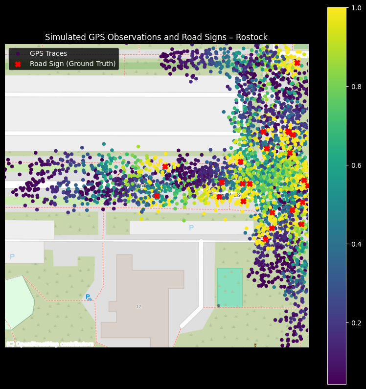
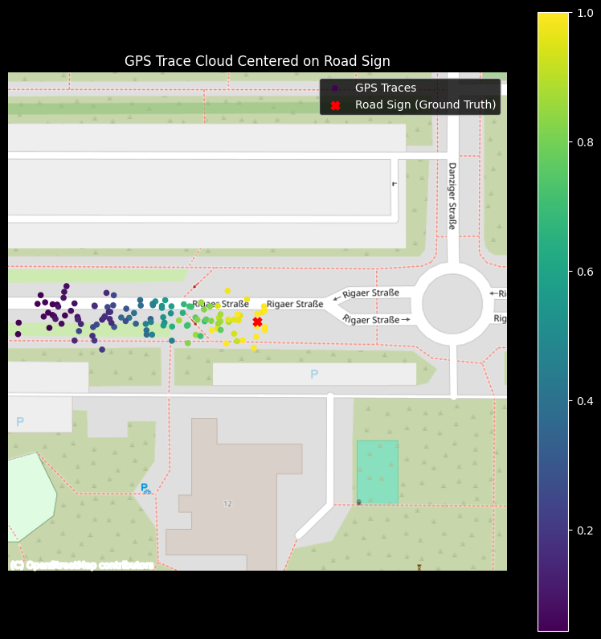
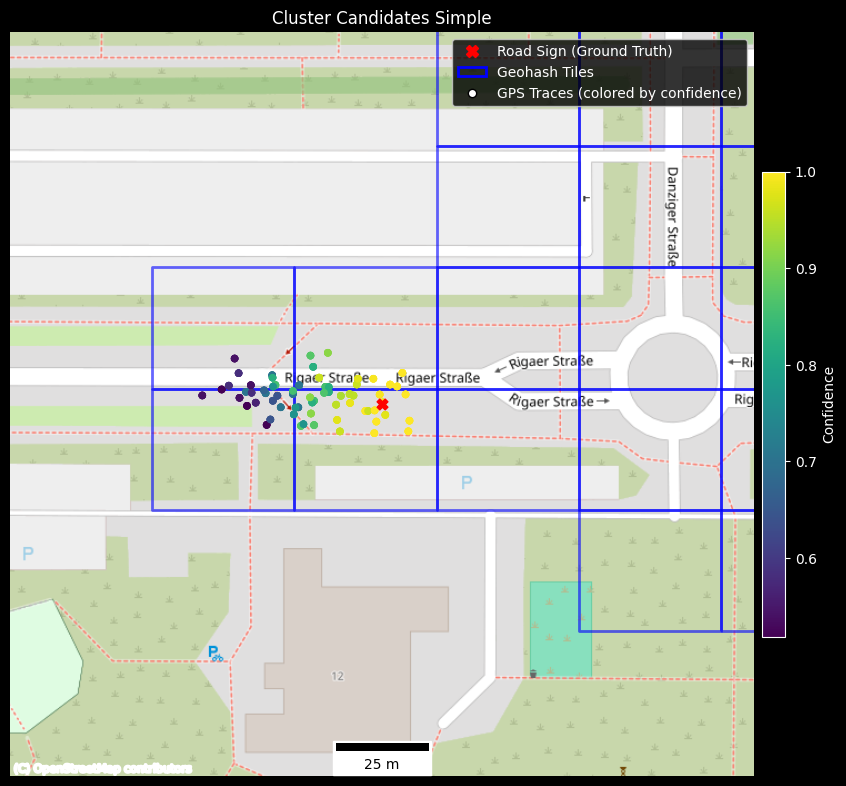
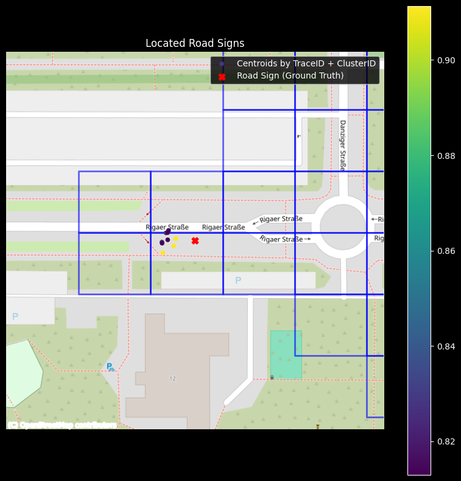
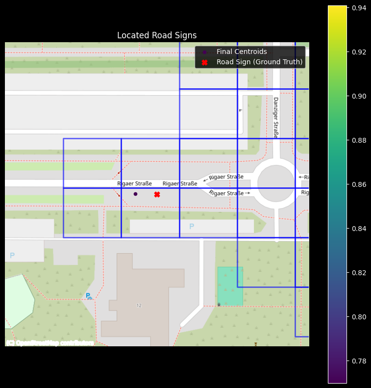
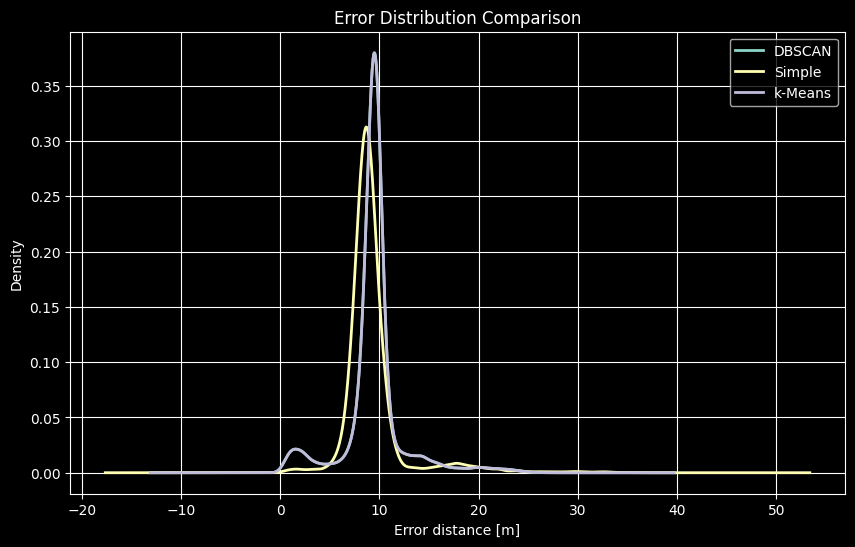
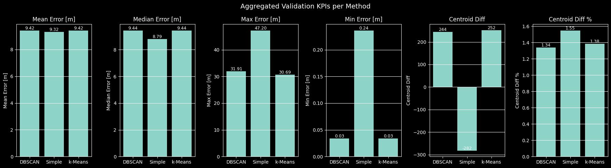

# Road Signs Locator

This project is an exploratory study on clustering noisy GPS-based observations to infer stationary objects (road
signs).
It uses three different approaches to locate road signs:

1. A **simple, iterative approach** calculating confidence-weighted centroids based on geohash neighborhoods.
2. A density-based approach using **DBSCAN**.
3. A **K-means** approach that makes use of the DBSCAN clusters.

The objective is to identify an optimal balance among accuracy, speed, and complexity, and to enhance comprehension of
the intricacies involved in cluster-based issues using geospatial information.

## How to Run

1. Install dependencies
    1. `pip install poetry`
    2. `poetry install`
2. Run mapping notebook `mapping.ipynb`

## Dataset & Preparation

As of now, there is no public dataset available containing GPS traces of road signs, e.g., generated from vehicles.
However, there are publicly available datasets containing road sign information with their exact GPS coordinates.

For this project the open dataset for Road signs of the city Rostock was used, which can be found here:
https://geo.sv.rostock.de/download/opendata/verkehrszeichen/verkehrszeichen.csv

Based on this dataset, GPS traces have been synthetically generated.

Synthetic trace generation allows controlled experimentation while keeping a known ground truth, at the cost of reduced
realism.

## GPS Trace Emitter

The input dataset already provides some beneficial columns:

- `latitude` & `longitude` for the actual location of the road sign
- `stvo_nummer` representing the type of road sign
- `standort_ausrichtung` representing the orientation (bearing) of the road sign relative to the street
- `uuid` representing the unique identifier of the road sign which is useful for validating our results

The synthetically generated GPS traces are based on the following assumptions / conditions:

- we simulate **10 rides per road sign**
- each ride has a random but (for simplicity) constant **speed between 5 and 34 m/s**
- the **speed influences the number of observations** per road sign (lower speed = more observations)
- the **bearing / orientation of each observation (trace)** always **follows the orientation of the road sign** and is
  therefore constant
    - this is again for simplicity reasons – in reality, the bearing would vary around the bearing of the sign
- we add **longitude and latitude noise** to the GPS traces to simulate real-world GPS clusters
- each trace comes with a **confidence between 0.0 and 1.0 depending on the distance** to the road sign where closer to
  the road sign means higher confidence
    - in reality, the confidence of the road sign image recognition would probably be highest at 20 to 10 m distance

The results of the emitted traces look like this:

And for a single road sign:

> **_NOTE:_** The emitter deliberately omits several real-world effects (e.g., correlated GPS drift, multipath errors,
> false-positive detections) to keep the problem tractable and focus on clustering behavior rather than sensor
> modeling.

## Road Sign Locator

Core of the project is the `SignLocator` class which contains the main logic for determining the road sign location
based on the provided GPS traces. Each approach works in a similar fashion pipeline. First, we collect possible
candidates for the clusters, then those clusters being merged – which basically means centroids are calculated for each
cluster.

> **_NOTE:_** Only traces with a confidence above 0.5 are considered for the clustering process.

### Simple Iterative Approach

The simple approach acts as a deterministic, explainable baseline that does not rely on global density assumptions.

It consists of three steps, one collecting cluster candidates, the other steps to merge the candidates
into centroids based on different criteria. All steps are iteratively repeated until convergence is reached – which
means that the number of centroids does not change anymore.

#### Collect Cluster Candidates

We first collect cluster candidates based on `geohash`, `sign_type`, `bearing`- this groups together
all observations that belong to a certain road sign within a geohash tile. The constant bearing per road sign trace
allows us `bearing` as a grouping parameter. **In a real world scenario, we would have to consider an actual range of
bearings.** The precision of the geohash is set to 8 which should avoid having multiple road signs of the same type and
orientation within a single tile.

However, traces of the same road sign can be spread out over multiple geohash tiles. To overcome this, we add
neighbor tiles to the same cluster candidates under certain conditions.

Those conditions are:

- the number of samples is below a certain threshold **OR** the avg confidence of the candidates is below a certain
  threshold **AND**
- the current cluster centroid's distance to the centroid of the neighbor cluster is below a certain threshold

In those cases, traces of neighbor tiles with the same road type and bearing are added to the same cluster.

Cluster candidates:

#### Merge Cluster Candidates by Trace ID and Cluster ID

In this merge step traces are grouped by trace ID and cluster ID. For each group centroids are calculated weighted
twice by confidence. This is supposed to enforce moving centroids closer towards the road sign. Afterward, we have
multiple centroids for each road sign.

Merged centroids by trace ID and cluster ID:

#### Merge Cluster Candidates by Cluster ID

In this merge step the previous step's centroids (by TraceID + ClusterID) are merged into a single centroid for each
cluster. Geohashes are recalculated based on the new centroids so that the process can start over again.

Merged centroids by cluster ID:

### DBSCAN

This is a density-based approach that basically determines clusters based on the number of samples within a certain
radius.

DBSCAN was chosen because it naturally handles variable cluster sizes and noise, which is typical for GPS-based
observations. However, parameter sensitivity (ε, min_samples) remains a challenge and requires careful tuning.

#### Collect Cluster Candidates

By passing the desired number of samples and radius, the DBSCAN algorithm determines clusters which will be added as
labels to the dataset.

#### Merge Cluster Candidates

Using the labels from the previous step, we can now group our candidates by cluster ID and calculate their centroids
confidence-weighted, just like in the simple iterative approach.

### K-Means

This approach is based on the DBSCAN clusters and is only applied for further tweaking of the centroids if certain
conditions are met. To do so, we first calculate the bounding box of each cluster and have a look at the maximum
distance of that box. If it exceeds a certain threshold, K-Means is applied to the cluster. This allows us to further
fine-tune clusters, e.g., if we assume over-merging of traces by DBSCAN. This might happen if two road signs of the
same type and orientation are located close to each other, so that cluster traces are overlapping.

> **NOTE:** The challenge when it comes to K-Means is that we have to determine the number of clusters beforehand. By
> applying
> DBSCAN first, we already have a pretty good approximation of that number. K-Means can now help to split clusters into
> multiple ones if we expect over-merging by DBSCAN. So in case the maximum spread of the bounding box exceeds our
> threshold, we split the cluster into at least two clusters – depending on the spread also into more.

**K-Means is not used as a primary clustering algorithm due to its hard cluster assumptions and the need to predefine
k.**

### Parameter Sensitivity and Failure Modes

The two main problems in our pipeline are basically:

1. Over-clustering of traces (= more clusters than road signs):
    1. Usually happens when traces of a sign are very scattered so that it is hard to determine a single cluster.
2. Over-merging of clusters (= fewer clusters than road signs)
    1. Usually happens when two road signs of the same type and orientation are located close to each other, so that
       cluster traces are overlapping.

The following table shows how to tweak the parameters to reduce the error caused by those problems:

|             | Over-Clustering                                                     | Over-Merging                                                        |
|-------------|---------------------------------------------------------------------|---------------------------------------------------------------------|
| **Simple**  | decrease `min_samples`, `min_confidence`  increase `min_radius` | increase `min_samples`, `min_confidence`  decrease `min_radius` |
| **DBSCAN**  | increase `min_samples`, `min_radius`                                | decrease `min_samples`, `min_radius`                                |
| **K-Means** | increase `min_samples`, `min_radius`, `max_spread`                  | decrease `min_samples`, `min_radius`, `max_spread`                  |

> **NOTE:** The main difference in tweaking parameters of the simple approach in comparison to the others is that we
> manipulate
> the conditions to include neighbor geohash tiles or not. So allowing more samples in a cluster, for example, would
> result in fewer neighbors to be included. This results in **more** clusters because traces of the same road sign
> that exist in a neighbor tile will **not be included** in the same cluster and build up a new one.

### Results

The overall results show of MAE of ~9m and a very similar median error, which can be explained by the shape of our
traces that don't build a cloud or circle but rather an elongated, oval shape. In addition to that, the max error
implies that over-merging happens quite often, which means we include close traces of the same road sign type and
orientation in the wrong cluster.

The long tail in the error distribution is primarily caused by over-merging, rather than centroid misplacement within
correctly identified clusters.

The centroid diff (number of calculated centroids - number of road signs) is below 2%, which is a promising result.

We can also see that K-Means barely improves the results as DBSCAN already determine a quite accurate number of
clusters. So in our case, K-Means is not really needed.

## Final Thoughts

This project demonstrates that clustering noisy GPS-based observations is less a question of choosing the “right”
algorithm and more about understanding the structure and failure modes of the data.

While DBSCAN perform remarkably well in this controlled setup, its success heavily relies on domain-specific
assumptions such as minimum spatial separation and consistent orientation. The simple iterative approach, although
heuristic in nature, offers a high degree of explainability and serves as a robust baseline. K-Means, on the other
hand, provides limited additional value once density-based clustering is properly tuned.

In a real-world scenario, additional dimensions such as temporal correlation, variable bearings, false-positive
detections, and sensor-specific noise would need to be incorporated. Nevertheless, the presented approaches form a
solid foundation for reasoning about stationary object localization from mobile observations and highlight the
importance of iterative refinement, validation against ground truth, and explicit trade-off management.

